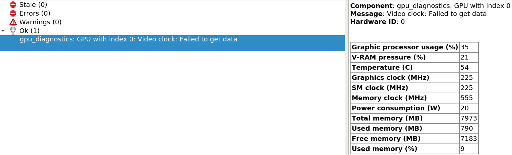

# ros_nvml_diagnostics
Collect gpu diagnostics informations from NVML and repulish them as ROS diagnostics.
Multi-gpu is supported.


## Prerequisite
On Ubuntu you will need to install nvml as cuda packages cannot be made part of rosdeps.
````
apt-get update
apt-get install cuda-nvml-dev-YOUR-CUDA-VERSION
````

## Getting started

1. Launch the node with the provided example launch file
````
roslaunch ros_nvml_diagnostics gpu_diagnostics.launch
````

2. Viewing the data
````
rosrun rqt_runtime_monitor rqt_runtime_monitor
````
